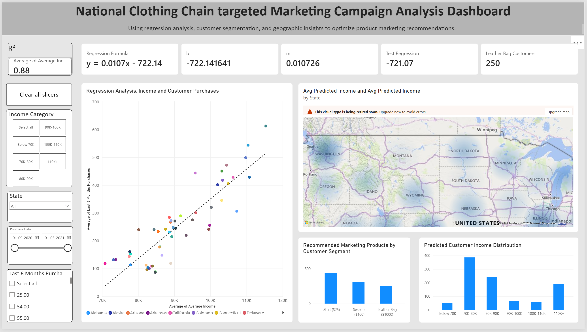
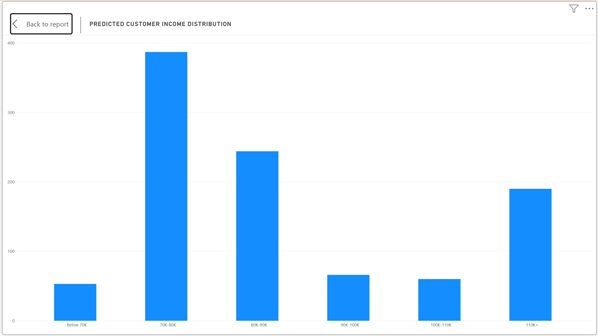

# Customer Segmentation Analysis using Power BI

## Project Overview

This project analyzes customer demographics, spending patterns, and geographic distribution to support targeted marketing strategies for a national clothing retailer. The solution was developed using Power BI, Power Query (M), and DAX.

## Business Objective

The objective of this project is to identify customer segments, understand purchasing behavior, and provide actionable insights that can improve marketing effectiveness and customer engagement.

## Tools and Technologies

- Power BI
- Power Query (M)
- DAX
- Data Modeling
- Statistical Analysis
- Regression Analysis (R²)

## Data Preparation

- Cleaned and transformed raw customer data using Power Query.
- Created calculated columns and measures using DAX.
- Built relationships and an optimized data model for reporting.

## Dashboard Features

- Customer Segmentation Analysis
- Geographic Heat Map
- Histogram Distribution Analysis
- Income vs Spending Regression Analysis
- Interactive Slicers and Cross Filtering
- KPI Cards and Summary Metrics

## Key Insights

- Identified customer groups with higher spending behavior.
- Analyzed regional customer distribution patterns.
- Evaluated relationships between income and spending through regression analysis.
- Provided insights to support targeted marketing campaigns.

## Skills Demonstrated

- Data Transformation
- Data Modeling
- DAX Development
- Power Query (M)
- Data Visualization
- Statistical Analysis
- Business Intelligence Reporting

## Dashboard Screenshots

### Dashboard Overview

### Heat Map

### Histogram

### Regression Analysis

### Customer Segments

## Repository Contents

- Power BI Project (.pbip)
- Report Files
- Semantic Model Files
- Dashboard Screenshots
- Project Documentation
